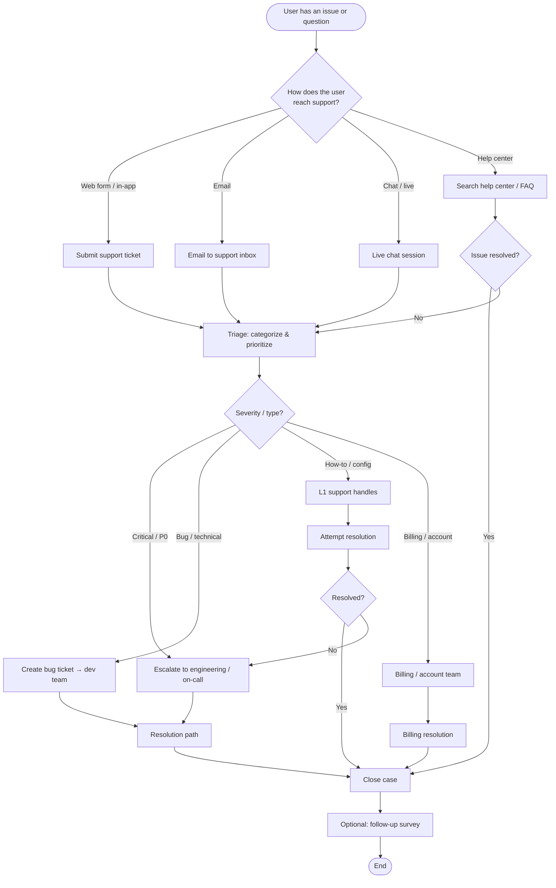
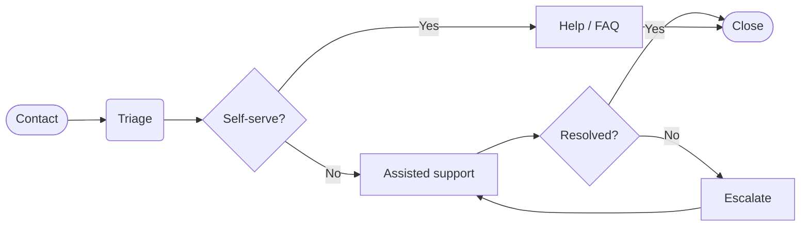

# Support Process Flowchart — New Web-Based Product

## Simplified view (high level)

## Notes

- **Triage**: Assign type (bug, how-to, billing), priority (P0–P2), and owner.
- **Escalation**: Define clear rules (e.g., P0 → on-call, unresolved L1 after X hours → L2).
- **Close**: Confirm with user when possible and record outcome for reporting.
